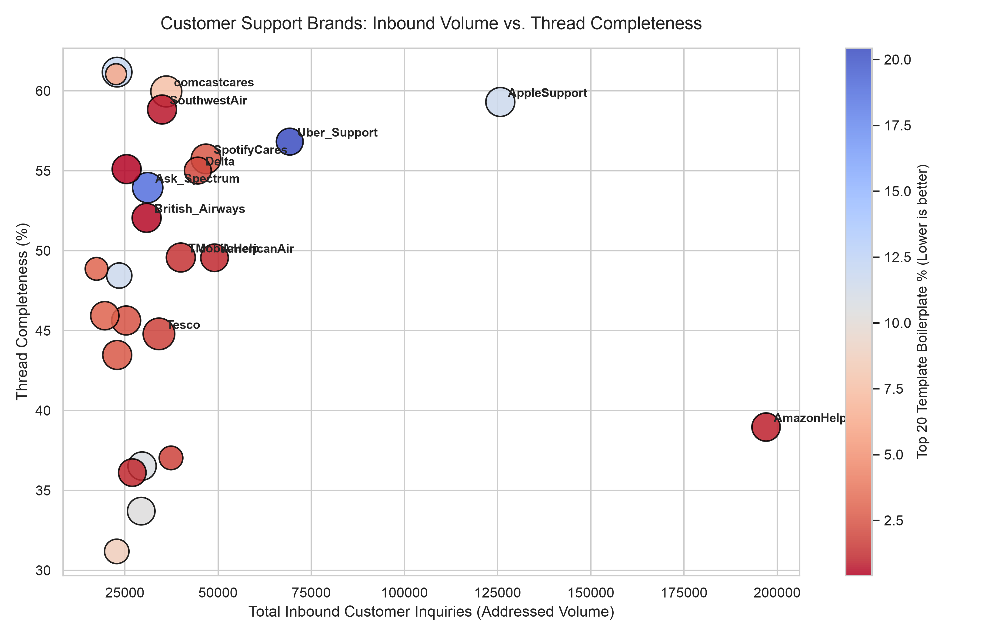
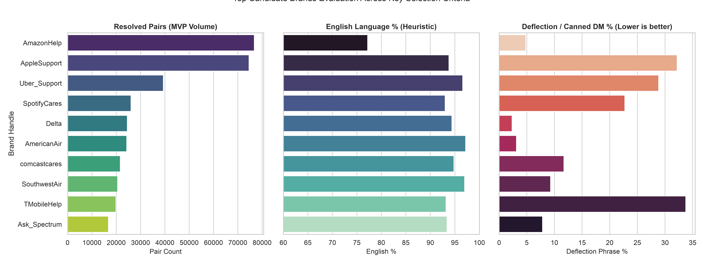

# Brand-Level Exploratory Data Analysis (EDA)

## Overview
This report provides a data-driven evaluation of the top customer support brands in Kaggle's *Customer Support on Twitter* (`twcs.csv`) dataset. The analysis measures inbound customer volume, thread reconstruction completeness, language distribution, topic diversity, and response boilerplate/deflection rates to inform brand selection for downstream AI support agent development.

## Top Brands Ranked Table

| Rank | Brand Handle | Inbound Volume | Resolved Pairs | Thread Completeness (%) | English (%) | Unique Word Ratio | TF-IDF Vocab | Median Words | Top 20 Template (%) | Deflection DM (%) |
| :--- | :--- | :--- | :--- | :--- | :--- | :--- | :--- | :--- | :--- | :--- |
| 1 | `AmazonHelp` | 197,016 | 76,750 | 38.96% | 77.2% | 0.0652 | 5,114 | 20 | 0.93% | 4.81% |
| 2 | `AppleSupport` | 125,728 | 74,562 | 59.30% | 93.8% | 0.0178 | 2,126 | 21 | 11.66% | 32.17% |
| 3 | `Uber_Support` | 69,237 | 39,338 | 56.82% | 96.6% | 0.0206 | 2,205 | 18 | 20.43% | 28.85% |
| 4 | `SpotifyCares` | 46,758 | 26,061 | 55.74% | 93.0% | 0.0237 | 3,092 | 22 | 2.66% | 22.72% |
| 5 | `Delta` | 44,576 | 24,520 | 55.01% | 94.4% | 0.0476 | 4,550 | 18 | 1.98% | 2.32% |
| 6 | `AmericanAir` | 49,053 | 24,304 | 49.55% | 97.2% | 0.0399 | 4,194 | 19 | 1.09% | 3.12% |
| 7 | `comcastcares` | 36,120 | 21,657 | 59.96% | 94.8% | 0.0199 | 2,816 | 24 | 7.63% | 11.70% |
| 8 | `SouthwestAir` | 34,981 | 20,581 | 58.83% | 97.0% | 0.0478 | 4,713 | 21 | 0.76% | 9.29% |
| 9 | `TMobileHelp` | 40,009 | 19,834 | 49.57% | 93.2% | 0.0400 | 4,456 | 21 | 1.40% | 33.75% |
| 10 | `Ask_Spectrum` | 31,128 | 16,790 | 53.94% | 93.4% | 0.0211 | 3,278 | 23 | 18.85% | 7.85% |
| 11 | `British_Airways` | 30,836 | 16,049 | 52.05% | 97.4% | 0.0429 | 5,330 | 21 | 0.51% | 8.75% |
| 12 | `Tesco` | 34,149 | 15,295 | 44.79% | 93.0% | 0.0405 | 5,626 | 25 | 1.84% | 4.57% |
| 13 | `hulu_support` | 25,474 | 14,035 | 55.10% | 97.2% | 0.0345 | 4,462 | 21 | 0.41% | 1.34% |
| 14 | `UPSHelp` | 22,925 | 14,024 | 61.17% | 93.4% | 0.0207 | 2,484 | 22 | 11.93% | 33.93% |
| 15 | `VirginTrains` | 37,384 | 13,845 | 37.03% | 95.0% | 0.0468 | 4,388 | 14 | 1.83% | 1.47% |
| 16 | `ChipotleTweets` | 22,651 | 13,826 | 61.04% | 91.6% | 0.0479 | 3,032 | 11 | 6.31% | 3.87% |
| 17 | `sprintcare` | 25,354 | 11,569 | 45.63% | 92.2% | 0.0308 | 4,118 | 21 | 2.38% | 37.45% |
| 18 | `AskPlayStation` | 23,495 | 11,381 | 48.44% | 84.8% | 0.0288 | 3,769 | 16 | 11.67% | 3.38% |
| 19 | `XboxSupport` | 29,620 | 10,818 | 36.52% | 93.6% | 0.0230 | 3,982 | 20 | 10.66% | 12.44% |
| 20 | `sainsburys` | 22,954 | 9,978 | 43.47% | 95.0% | 0.0380 | 5,058 | 21 | 2.67% | 10.31% |
| 21 | `ATVIAssist` | 29,392 | 9,905 | 33.70% | 91.8% | 0.0296 | 3,403 | 19 | 10.41% | 9.65% |
| 22 | `GWRHelp` | 27,000 | 9,749 | 36.11% | 97.6% | 0.0373 | 5,321 | 19 | 1.09% | 0.21% |
| 23 | `O2` | 19,624 | 9,014 | 45.93% | 96.6% | 0.0320 | 4,618 | 20 | 3.06% | 16.65% |
| 24 | `Safaricom_Care` | 17,411 | 8,507 | 48.86% | 88.4% | 0.0780 | 4,596 | 13 | 3.13% | 1.41% |
| 25 | `VerizonSupport` | 22,824 | 7,116 | 31.18% | 92.4% | 0.0305 | 4,051 | 15 | 8.66% | 9.62% |

## Metric Definitions & Methodology
- **Inbound Volume**: Total customer inquiries addressed to the brand (inbound tweets mentioning the handle or receiving direct replies).
- **Resolved Pairs**: Count of initial customer inquiries successfully paired with the brand's first substantive reply.
- **Thread Completeness (%)**: Ratio of resolved conversation pairs to total addressed inbound volume.
- **English (%)**: Heuristic language classification on a random sample of 500 inbound inquiries using `langdetect` (*Note: Language detection is a heuristic; its error rate is unmeasured*).
- **Topic Diversity**: Unique-word token ratio and TF-IDF vocabulary size (min_df=2) across the brand's historical outbound replies.
- **Median Reply Words**: Median word count per outbound tweet from the brand.
- **Top 20 Template (%)**: Percentage of the brand's total replies accounted for by its top 20 most frequent exact-text templates (after stripping handles and URLs).
- **Deflection DM (%)**: Percentage of replies containing canned deflection triggers (`DM us`, `reach out at`, `send a private message`).

## Supporting Visualizations

